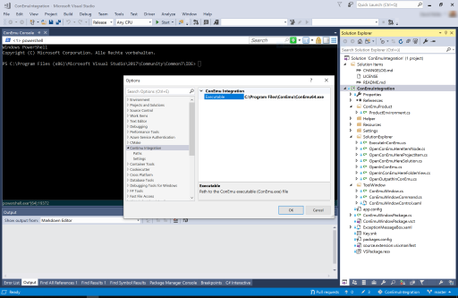
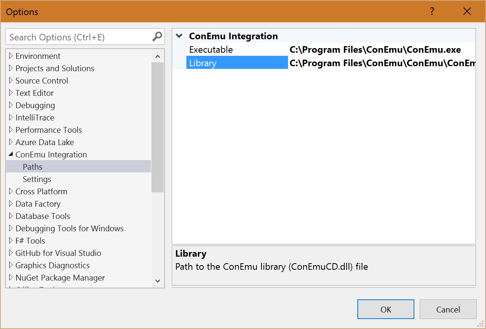

# ConEmu Integration

<b>ConEmu Integration</b> 

Using the console emulator ConEmu within Visual Studio. 
Download this extension from the <a href="https://visualstudiogallery.msdn.microsoft.com/a0536370-40e4-4141-8f51-5f00d0434012">VS Gallery</a>

This project integrates the console emulator ConEmu in Visual Studio. 
ConEmu is not part of this extension and needs to be downloaded / installed seperatly. 
See the ConEmu section for further detail about the console emulator.

See the [changelog](CHANGELOG.md) for changes and roadmap.

## System Requirements

- Installed Visual Studio 2015 or Visual Studio 2013
- Installed or portable version of ConEmu
- ConEmu build 151201 or higher is required
- ConEmuCD.dll x86 version has to be used (x64 version isn't supported)
- ConEmu.exe can be used in x86 as well as in x64 version
- Path to ConEmu[64].exe and ConEmuCD.dll set in the Visual Studio settings

## ConEmu

ConEmu is a Windows console emulator which is not part of this Visual Studio extension.
Please download and install it seperatly. You can find them using the links below.

ConEmu project: <a href="https://github.com/Maximus5/ConEmu">GitHub</a> 
ConEmu integration: <a href="https://github.com/Maximus5/conemu-inside">GitHub</a> and <a href="https://www.nuget.org/packages/ConEmu.Control.WinForms/">NuGet Package</a>

## Features

- Integration of ConEmu as ToolWindow to Visual Studio
- ConEmu Tool Window can be opens from "View" menu
- Integration of ConEmu in Solution Explorer
    - Open the containing folder of the item in conemu
    - Open the output path of the project in conemu
    - Execute the from the project created binary using conemu

### Integration of ConEmu as ToolWindow to Visual Studio
This extension integrates ConEmu as tool window in Visual Studio. 
 

### ConEmu Tool Window can be opens from "View" menu
The ConEmu tool window can be open from the view menu of Visual Studio 
 

### Integration of ConEmu in Solution Explorer
The current opened folder in ConEmu can be changed directly from solution explorer. 
The output file of your project can be also executed in conemu. 
 

## Settings
Please download / install the ConEmu seperatly. It isn't part of this extension.
After you have downloaded / installed ConEmu please set the paths in the settings of this extension.
Therefor open the settings of Visual Studio and navigate to the "ConEmu Integration" section.

Visual Studio is a x86 application and this extension runs in the context of te Visual Studio process.
It isn't possible to load x64 libraries from a x86 application.
So please configure here the paths to the x86 version of conemu (ConEmu.exe, ConEmuCD.dll) 
and not the paths to x64 (ConEmu64.exe, ConEmuCD64.dll) version.

Please set the following two paths in this section of the configuration. 
The path to the conemu executable file: 
 
E.g.: C:\Users\David Roller\Downloads\ConEmuPack.160504\ConEmu.exe 

The path to the conemu CD library file: 
 
E.g.: C:\Users\David Roller\Downloads\ConEmuPack.160504\ConEmu\ConEmuCD.dll 

## Contribute
Check out the [contribution guidelines](CONTRIBUTING.md)
if you want to contribute to this project.

For cloning and building this project yourself, make sure
to install the
[Extensibility Tools 2015](https://visualstudiogallery.msdn.microsoft.com/ab39a092-1343-46e2-b0f1-6a3f91155aa6)
extension for Visual Studio which enables some features
used by this project.

## License
[Apache 2.0](LICENSE)

ConEmu and ConEmu Inside has different licenses. 
Please have a look on their github pages for the license details.
