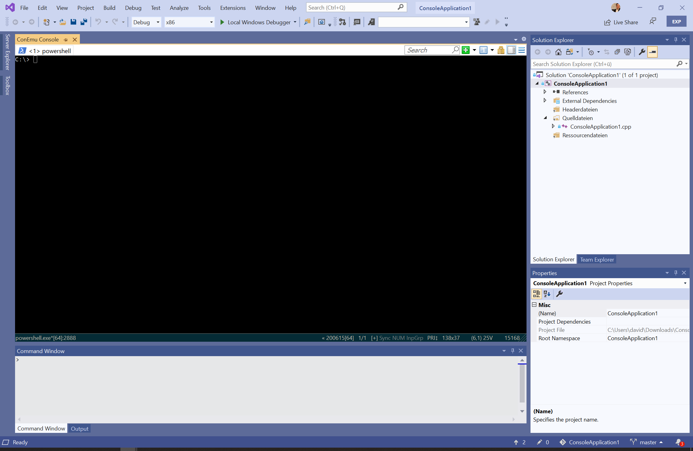
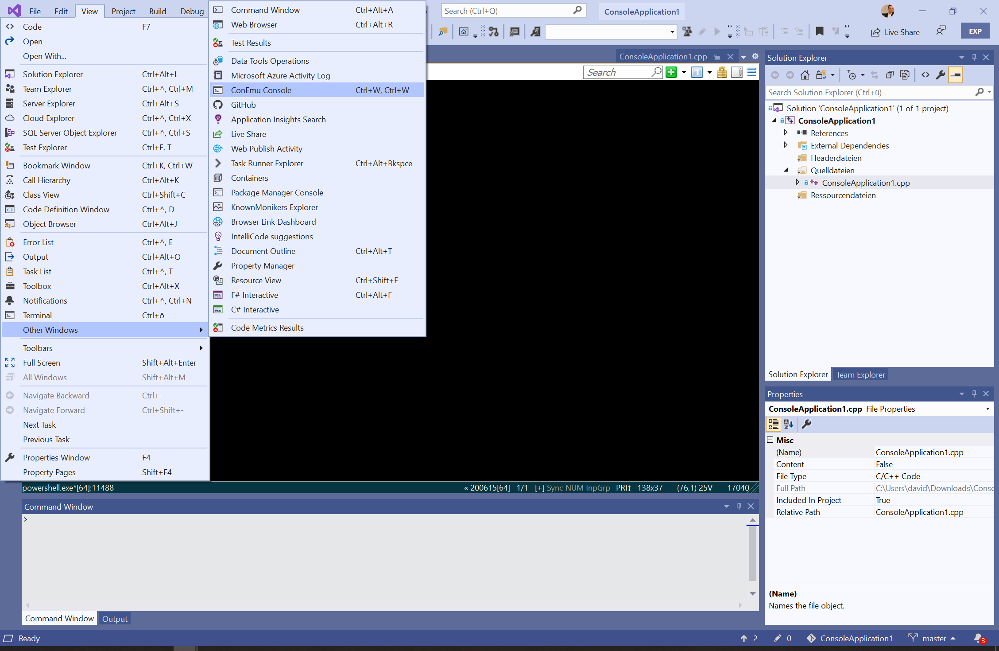

# ConEmu Integration

|-----------------|-----------------|
||ConEmu Integration  Using the console emulator ConEmu within Visual Studio. Download this extension from the <a href="https://visualstudiogallery.msdn.microsoft.com/[GuidFromGallery]">VS Gallery</a>

---------------------------------------

This project integrates the console emulator ConEmu in Visual Studio. 
ConEmu is not part of this extension and needs to be installed seperatly. 
See the ConEmu section for further detail about the console emulator.

See the [changelog](CHANGELOG.md) for changes and roadmap.

## ConEmu
<table border="0">
    <tr>
        <td>
            
        </td>
        <td>
            ConEmu project: <a href="https://github.com/Maximus5/ConEmu">GitHub</a> 
            ConEmu integration: <a href="https://github.com/Maximus5/conemu-inside">GitHub</a> and <a href="https://www.nuget.org/packages/ConEmu.Control.WinForms/">NuGet Package</a>
        </td>
    </tr>
</table>

ConEmu-Maximus5 is a Windows console emulator which is not part of this Visual Studio extension. 
Please download and install it seperatly. You can find them using the links below.

## Features

- Integration of ConEmu as ToolWindow to Visual Studio
- ConEmu Tool Window can be opens from "View" menu
- Integration of ConEmu in Solution Explorer

### Integration of ConEmu as ToolWindow to Visual Studio
This extension integrates ConEmu as tool window in Visual Studio.

### ConEmu Tool Window can be opens from "View" menu
The ConEmu tool window can be open from the view menu of Visual Studio

### Integration of ConEmu in Solution Explorer
The current opened folder in ConEmu can be changed directly from solution explorer.

## Contribute
Check out the [contribution guidelines](CONTRIBUTING.md)
if you want to contribute to this project.

For cloning and building this project yourself, make sure
to install the
[Extensibility Tools 2015](https://visualstudiogallery.msdn.microsoft.com/ab39a092-1343-46e2-b0f1-6a3f91155aa6)
extension for Visual Studio which enables some features
used by this project.

## License
[Apache 2.0](LICENSE)

ConEmu and ConEmu Inside has different licenses. 
Please have a look on their github pages for the license details.
